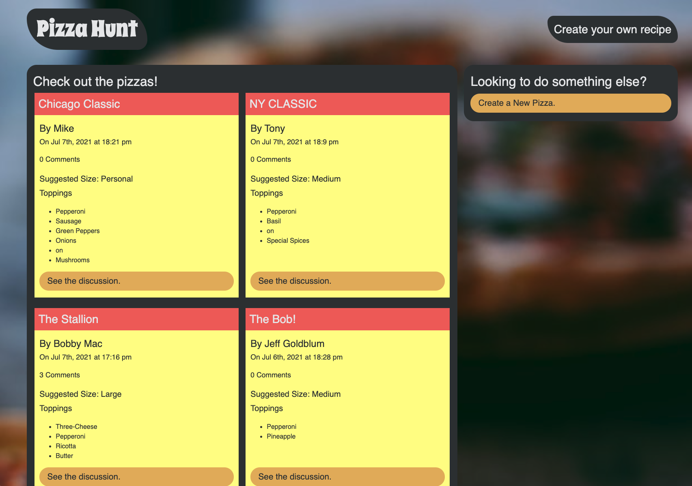

# Mongo-Pizza_Hunt

GitHub Repo: [https://github.com/jlentz1/pizza-hunt](https://github.com/jlentz17/pizza-hunt)  

Deployed at: [https://boiling-beyond-47743.herokuapp.com/](https://boiling-beyond-47743.herokuapp.com/)  

## Preview

## Description
A website designed for a Pizza Company where users can view a list of pizza creations and create their own.  Users can also participate in discussions on the creations by posting comments and replies.

## Table of Contents
- [Technologies](#Technologies)
- [Installation](#Installation)
- [Usage](#usage)
- [Contributions](#Contributions)
- [Contact](#Contact)
- [License](#license)

## Technologies
This project was built using HTML, CSS, Javascript, Bootstrap styling, as well as:

* Node
* NoSQL
* Express
* MongoDB
* MongoDB Atlas

## Installation
Install npm required dependencies by running (`npm i`) in the command line.

## Usage
- Visit deployed website to be taken to the homepage.
- Click on "Create a New Pizza" to be taken to the pizza creation form.
- Fill out the Form to create your own pizza Masterpiece and then "submit Recipe".
-

## Contributions
Developed by Jeremy Lentz, 2021

## Contact
Contact me with any questions
- Github Profile: (https://github.com/jlentz17)
- E-mail me: jlentz17@gmail.com
